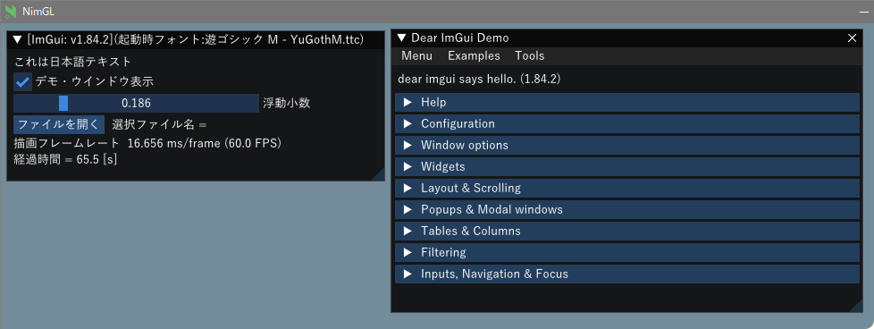

### Nimgl test program for japanese fonts

Nimgl: ImGui demo program test for Japanese fonts  
Written by audin 2023/02

ImGui/Nimglで日本語表示・入力のテスト

詳細は[ここ](https://mpu.seesaa.net/article/498328270.html)を参照

#### Prerequisite

---
- nim-1.6.14 at this moment
- For Linux Debian 11 Bullseye

   ```sh
   $ sudo apt install xorg-dev libopengl-dev ibgl1-mesa-glx libgl1-mesa-dev
   ```

#### Compile and run

---

適当な作業フォルダで

```sh
$ git clone https://github.com/dinau/nimgl_test
$ cd nimgl_test
```

```sh
$ make
```

or

```sh
$ nimble build 
```

実行は、

```sh
$ ./nimgl_test
```

以下は実行結果




#### フォント追加方法

---

```nim
io.Fonts->AddFontDefault();
io.Fonts->AddFontFromFileTTF("c:\\Windows\\Fonts\\segoeui.ttf", 18.0f);
```

プロトタイプ宣言

```nim
proc addFontFromFileTTF*(self: ptr ImFontAtlas
    , filename: cstring
    , size_pixels: float32
    , font_cfg: ptr ImFontConfig = nil
    , glyph_ranges: ptr ImWchar = nil): ptr ImFont
    {.importc: "ImFontAtlas_AddFontFromFileTTF".}
```

#### 日本語入力(IME)について

---

以下のコンパイル/リンク時オプションを加えることで日本語入力を可能としている

```sh
--passc:"-DIMGUI_ENABLE_WIN32_DEFAULT_IME_FUNCTIONS"
--passL:"-limm32"
```

同じことをconfig.nims内に記述する場合は以下となる

```nim
switch "passC","-DIMGUI_ENABLE_WIN32_DEFAULT_IME_FUNCTIONS"
switch "passL","-limm32"
```

#### 参考

[Viewport, Platform: Fixed IME positioning for multi-viewport. Moved API from...](http://dalab.se.sjtu.edu.cn/gitlab/xiaoyuwei/imgui/-/commit/cb78e62df93732b64afcc9d4cd02e378730b32af)

[ImGui で日本語と記号♥と絵文字😺の表示](https://zenn.dev/tenka/articles/display_japanese_symbols_and_emoji_with_imgui)

