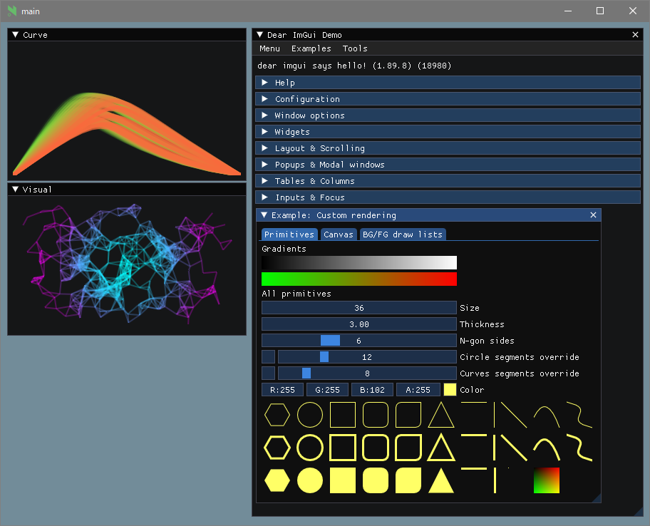
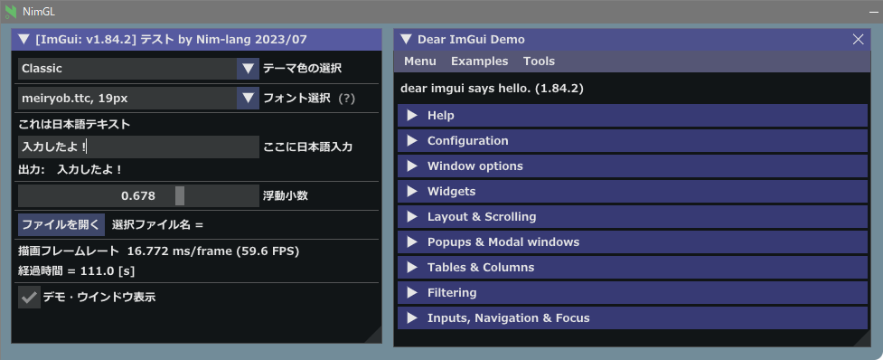

<!-- START doctoc generated TOC please keep comment here to allow auto update -->
<!-- DON'T EDIT THIS SECTION, INSTEAD RE-RUN doctoc TO UPDATE -->

- [Nimgl / ImGui test program](#nimgl--imgui-test-program)
  - [Contents demo program](#contents-demo-program)
  - [Prerequisite](#prerequisite)
  - [Examples](#examples)
  - [Adding fonts](#adding-fonts)
  - [IME for Japanese / 日本語入力(IME)について](#ime-for-japanese--%E6%97%A5%E6%9C%AC%E8%AA%9E%E5%85%A5%E5%8A%9Bime%E3%81%AB%E3%81%A4%E3%81%84%E3%81%A6)
  - [参考](#%E5%8F%82%E8%80%83)

<!-- END doctoc generated TOC please keep comment here to allow auto update -->

### Nimgl / ImGui test program

**Note**: Using  **ImGui v1.89.8** (2023/08) [https://github.com/dinau/nimgl-imgui](https://github.com/dinau/nimgl-imgui)  
forked from https://github.com/daniel-j/nimgl-imgui .

#### Contents demo program

---

1.  ImDrawList party demo
1.  Dmeo for setting Japanese fonts and IME input text

#### Prerequisite

---

- OS: Windows10 or later, Debian 12 Bookworm (Linux)
- nim-1.6.14 or later
- For Linux Debian 12 Bookworm

   ```sh
   $ sudo apt install xorg-dev libopengl-dev libgl1-mesa-dev
   ```

- Download 

   ```sh
   $ git clone https://github.com/dinau/nimgl_test
   $ cd nimgl_test
   ```

- Install dependencies

   ```sh
   $ pwd
   nimgl_test
   $ nimble build
   ```


#### Examples

---

- [ImDrawList coding party - deadline Nov 30, 2020! #3606](https://github.com/ocornut/imgui/issues/3606)  
This demo has been converted to Nim lang from two programs,  
[Curve](https://github.com/ocornut/imgui/issues/3606#issuecomment-730648517) and
[Real-time visualization of the interweb blogosphere](https://github.com/ocornut/imgui/issues/3606#issuecomment-730704909).  

   - Build and run

      ```sh
      $ pwd 
      nimgl_test
      $ nimble party
      ```

- Dmeo for setting Japanese fonts and IME input text
   - (2023/07) Selectable three themes and four Japanse fonts (Windows10)  
   
   - Download: Windows10 sample exe file  
   [nimgl-test-jp-font-imgui-v1.84.2-ime-ok-2023-07.exe.7z](https://bitbucket.org/dinau/storage/downloads/nimgl-test-jp-font-imgui-v1.84.2-ime-ok-2023-07.exe.7z) 
   - Build and run

      ```sh
      $ pwd 
      nimgl_test
      $ nimble jpfont
      ```


#### Adding fonts 

---

Source: [setupFonts.nim](https://github.com/dinau/nimgl_test/blob/main/examples/jpFont/setupFonts.nim)

- Nim prototype definition

   ```nim
   proc addFontFromFileTTF*(self: ptr ImFontAtlas
       , filename: cstring
       , size_pixels: float32
       , font_cfg: ptr ImFontConfig = nil
       , glyph_ranges: ptr ImWchar = nil): ptr ImFont
       {.importc: "ImFontAtlas_AddFontFromFileTTF".}
   ```

- C++

  ```cpp
  io.Fonts->AddFontDefault();
  io.Fonts->AddFontFromFileTTF("c:\\Windows\\Fonts\\segoeui.ttf", 18.0f);
  ```

#### IME for Japanese / 日本語入力(IME)について

---

以下のNim言語コンパイル / リンク時オプションを加えることで日本語入力を可能としている  
オプションはバックエンドのC/C++コンパイラにのみ渡される

```sh
--passc:"-DIMGUI_ENABLE_WIN32_DEFAULT_IME_FUNCTIONS"
--passL:"-limm32"
```

同じことをconfig.nims内に記述する場合は以下となる

```nim
switch "passC","-DIMGUI_ENABLE_WIN32_DEFAULT_IME_FUNCTIONS"
switch "passL","-limm32"
```

#### 参考

---

[Dear ImGuiで日本語入力時のIMEの位置をいい感じにする](https://qiita.com/babiron_i/items/759d80965b497384bc0e)  
[Viewport, Platform: Fixed IME positioning for multi-viewport. Moved API from...](http://dalab.se.sjtu.edu.cn/gitlab/xiaoyuwei/imgui/-/commit/cb78e62df93732b64afcc9d4cd02e378730b32af)  
[ImGui で日本語と記号♥と絵文字😺の表示](https://zenn.dev/tenka/articles/display_japanese_symbols_and_emoji_with_imgui)  

