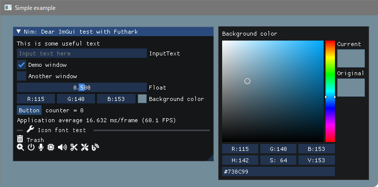
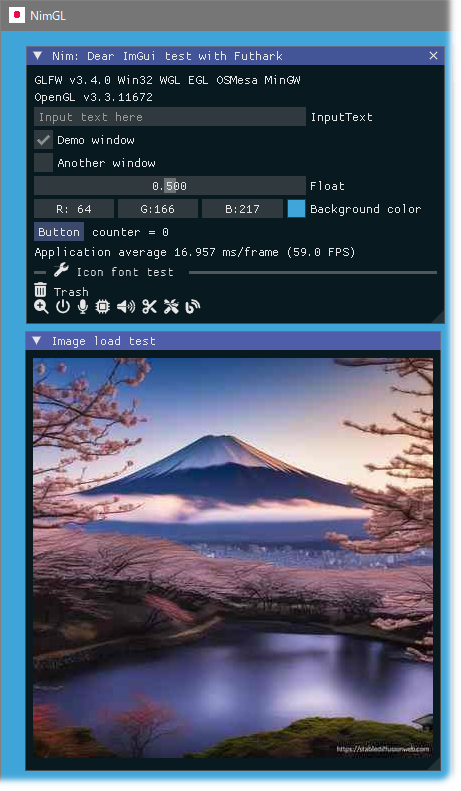
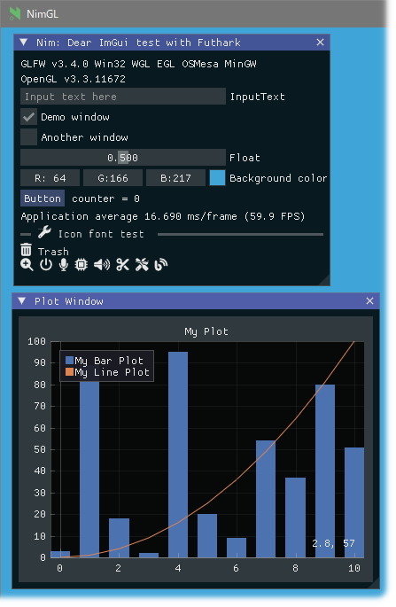
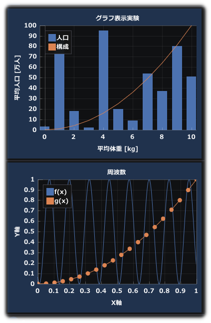

<!-- START doctoc generated TOC please keep comment here to allow auto update -->
<!-- DON'T EDIT THIS SECTION, INSTEAD RE-RUN doctoc TO UPDATE -->

- [Nimgl / ImGui demo program](#nimgl--imgui-demo-program)
  - [Prerequisite](#prerequisite)
  - [Install dependencies](#install-dependencies)
  - [Examples](#examples)
    - [glfw_opengl3.nim](#glfw_opengl3nim)
    - [glfw_opengl3_image_load.nim](#glfw_opengl3_image_loadnim)
    - [glfw_opengl3_implot.nim](#glfw_opengl3_implotnim)
    - [imDrawListParty.nim](#imdrawlistpartynim)
    - [implot_jp.nim](#implot_jpnim)
    - [jpFont.nim](#jpfontnim)
  - [IME for Japanese / 日本語入力(IME)について](#ime-for-japanese--%E6%97%A5%E6%9C%AC%E8%AA%9E%E5%85%A5%E5%8A%9Bime%E3%81%AB%E3%81%A4%E3%81%84%E3%81%A6)
  - [My tools version](#my-tools-version)
  - [参考](#%E5%8F%82%E8%80%83)

<!-- END doctoc generated TOC please keep comment here to allow auto update -->

### Nimgl / ImGui demo program

**Note**: Using  **ImGui v1.89.9** (2023/09) [https://github.com/dinau/nimgl-imgui](https://github.com/dinau/nimgl-imgui)  
forked from https://github.com/daniel-j/nimgl-imgui .

#### Prerequisite

---

- OS: Windows10 or later, Debian 12 Bookworm (Linux)
- nim-1.6.20 or later
- Download 

   ```sh
   $ git clone https://github.com/dinau/nimgl_test
   $ cd nimgl_test
   ```

- For Linux Debian 12 Bookworm or later

   ```sh
   $ sudo apt install xorg-dev libopengl-dev libgl1-mesa-dev
   ```


#### Install dependencies

---

   ```sh
   $ pwd
   nimgl_test
   $ nimble build
   ```

#### Examples

---

#####  [glfw_opengl3.nim](examples/glfw_opengl3/glfw_opengl3.nim)

---

   ```sh
   $ pwd 
   nimgl_test
   $ cd examples/glfw_opengl3
   $ make run
   ```




#####  [glfw_opengl3_image_load.nim](examples/glfw_opengl3_image_load/glfw_opengl3_image_load.nim)

---

   ```sh
   $ pwd 
   nimgl_test
   $ cd examples/glfw_opengl3_image_load
   $ make run
   ```



#####  [glfw_opengl3_implot.nim](examples/glfw_opengl3_implot/glfw_opengl3_implot.nim)

---

   ```sh
   $ pwd 
   nimgl_test
   $ cd examples/glfw_opengl3_implot
   $ make run
   ```



##### [imDrawListParty.nim](examples/imDrawListParty/imDrawListParty.nim)

---

```sh
$ pwd 
nimgl_test
cd examples/imDrawListParty
$ make run
```

[ImDrawList coding party - deadline Nov 30, 2020! #3606](https://github.com/ocornut/imgui/issues/3606)  
This demo has been converted to Nim lang from two programs,  
[Curve](https://github.com/ocornut/imgui/issues/3606#issuecomment-730648517)  
  
and [Real-time visualization of the interweb blogosphere](https://github.com/ocornut/imgui/issues/3606#issuecomment-730704909).  


  


##### [implot_jp.nim](examples/implot_jp/implot_jp.nim)

---

ImPlot demo with Japanese fonts

   ```sh
   $ pwd 
   nimgl_test
   $ cd examples/implot_jp
   $ make run
   ```

     

##### [jpFont.nim](examples/jpFont/jpFont.nim)

---

```sh
$ pwd 
nimgl_test
$ cd examples/jpfont
$ make run
```


- Download: Windows10 sample exe file  
[nimgl-test-jp-font-imgui-v1.84.2-ime-ok-2023-07.exe.7z](https://bitbucket.org/dinau/storage/downloads/nimgl-test-jp-font-imgui-v1.84.2-ime-ok-2023-07.exe.7z) 

#### IME for Japanese / 日本語入力(IME)について

---

以下のNim言語コンパイル / リンク時オプションを加えることで日本語入力を可能としている  
オプションはバックエンドのC/C++コンパイラにのみ渡される

```sh
--passc:"-DIMGUI_ENABLE_WIN32_DEFAULT_IME_FUNCTIONS"
--passL:"-limm32"
```

同じことをconfig.nims内に記述する場合は以下となる

```nim
switch "passC","-DIMGUI_ENABLE_WIN32_DEFAULT_IME_FUNCTIONS"
switch "passL","-limm32"
```

#### My tools version

---

- Nim Compiler Version 2.0.6 
- gcc.exe (Rev2, Built by MSYS2 project) 13.2.0-2
- gcc-libs 13.2.0-2
- binutils 2.41-3 
- git version 2.41.0.windows.3
- make: GNU Make 4.2.1

#### 参考

---

[Dear ImGuiで日本語入力時のIMEの位置をいい感じにする](https://qiita.com/babiron_i/items/759d80965b497384bc0e)  
[Viewport, Platform: Fixed IME positioning for multi-viewport. Moved API from...](http://dalab.se.sjtu.edu.cn/gitlab/xiaoyuwei/imgui/-/commit/cb78e62df93732b64afcc9d4cd02e378730b32af)  
[ImGui で日本語と記号♥と絵文字😺の表示](https://zenn.dev/tenka/articles/display_japanese_symbols_and_emoji_with_imgui)  
